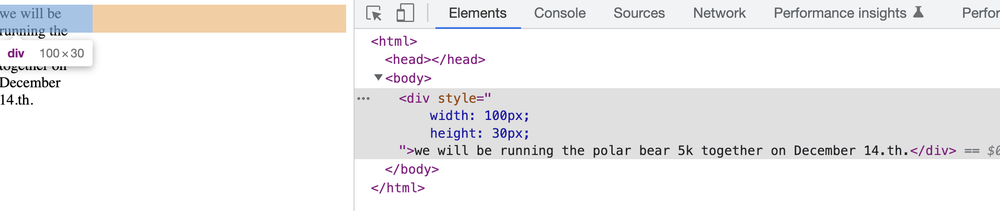

[[toc]]
## 盒模型

### 元素宽度问题

main标签在IE不兼容的模式下被渲染为行内元素，需要通过display:block进行修复该问题；
一个左右结构的布局，可以通过float来进行布局，宽度使用百分比，如果内部有padding或者border的情况下，可能就会有问题了，解决方案如下:
- 利用calc(100% - 2rem) 来计算
- 通过box-sizing: border-box来进行修复

box-sizing 默认属性为content-box, 及任何指定的宽或高都只会设置内容盒子的大小， 如果为border-box的话，则会设置内容、内边距以及边框大小总和。

### 元素高度问题
border-box修改对高度也起作用。
#### 控制溢出行为
当明确一个元素的高度时，内容可能会溢出容器

x

控制内容溢出的行为可以使用overflow, overflow有四个属性值
- visible 默认值， 所有内容可见
- hidden 溢出内边框边缘的内容被裁剪，无法看见
- scroll 容器出现滚动条
- auto 只有容器溢出容器才会出现滚动条

也可以单独对overflow-x, overflow-y进行控制。 

#### 百分比高度的备选方案

要想让百分比高度生效，必须给氟元素明确定义个高度。

- 如果是ie8+，可以使用display: table，display:tabel-cell来控制；
- 也可以使用flex布局，仅支持ie9以上， ie10还要求加上浏览器前缀。
  
#### 使用min-height和max-height

#### 垂直居中内容
vertical-align 声明只会影响到行内元素或者table-cell元素。

垂直居中可以参考如下：

- 可以用一个自然高度的容器 （给容器加上相等的上下那边距）
- 容器需要指定高度或者避免使用内边距（容器使用table-cell）和vertical-align控制
- 可以使用flex (如果是ie9以上)
- 容器里面只有一行文字内容 （设置一个行高）
- 容器和内容的高度都知道 （使用内容绝对定位）
- 不知道内部元素的高度 （用绝对定位结合transform）

如果还不确定，可以使用howtocenterincss网站来断定。

### 负外边距
负边距不常用，但在某些场景下很实用，尤其是当创建列布局的时候。尽量不要频繁使用。

### 外边距折叠

#### 文字折叠
段落p默认有1em上外边距和下外边距。折叠外边距的大小等于相邻外边距的最大值。

#### 多个外边距折叠
即使两个元素不是相邻的兄弟节点也会产生边外距折叠。即使将这个段落用一个额外的div包裹起来。

::: tip
只有上下外边距会产生折叠，左右外边距不会折叠。
:::

Flex布局的元素不会上下外边距产生折叠。

解决方案：
- 使用内边距
- 对容器使用overflow:auto 或者非visible的值，防止内部元素的外边距跟容器外部的外边距折叠
- 在两个外边距之间加上边框或者内边距
- 如果容器为浮动元素，內联块，绝对定位或者固定定位是，外边距不会在它外面折叠
- 使用flex布局内的元素之间不会发生外边距折叠
- 元素西岸市委table-cell时不具备外边距属性，因此他们不会折叠

### 容器内的元素间距

容器的内边距和内容之间的外边距之间的相互作用处理起来很棘手。
```html
<div class="box">
    <div>a</div>
    <div>b</div>
</div>
```
```css
.box {
    padding: 1.5em;
}
div {
    margin-top: 1.5em;
}
```
这样的话上方的空白会多出1.5em,
比较简单的方法是给下面的div设置margin-top即可
``` css
div + div {
    margin-top: 1.5em;
}
```
这种解决方案会导致如果最后面动态插入，内容改变了就不会生效了，不是最好的解决方案；

#### 更通用的解决方法 - 猫头鹰选择器
```css
/**
 * + * 猫头鹰选择器
*/
```
全局控制相邻的兄弟节点会按照该规则，比如说
```css
body * + * {
    margin-top: 1.5em;
}
```
猫头鹰选择器是需要权衡的，它省去了需要的需要设置外边距的地方，但是在某些不想家外边距的地方则需要覆盖，猫头鹰选择器也并非所有项目的正确选择，如果是新项目则可以考虑，如果是已有项目就很可能破坏已有布局。


