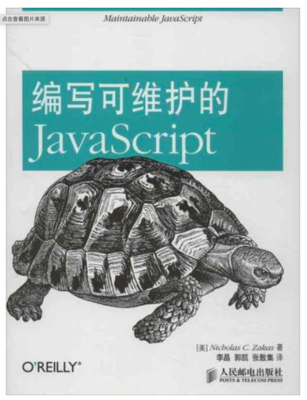

   

开始前说句废话先，
https://google.github.io/styleguide/jsguide.html
该页面是谷歌关于js编写的一些规范，有机会翻译成中文版本。

利用大约不到一周的时间将该书翻阅完，当然有些内容我是给忽略了，因为现在有更高级的用法和工具，接下来将本书我看到的觉得有用的东西个大家整理一下。

## 编程风格 (style guideline)
编码规范包含编程风格，编程风格是个人的事，但一旦有团队合作这个作用就很大了，建议个人项目也要做到风格规范，标准，但究竟是那种好，我说不上来，我只是把我认为不错的风格给列举出来。

本书中也列举出来jslint和jshint，有幸几年前用过，但现在有vscode和丰富的插件来管理，相信要比这个更好些，eslint等。

## 基本格式化
    
### 缩进层级

   适度的缩进是万里长城的第一步，这种做法可以带来其他可维护性方面的提升。

   通常缩紧有2、4、8个空格，一般折中我喜欢用4个空格做缩进。


有赖于分析器的自动分号插入(Automatic Semicolon Insertion, ASI)机制，javascript省略分号也可以正常工作，通常情况下没问题，个别情况会有意想不到的效果。

``` javascript
function test() {
    return 
    {
        name: "Jack"
    }
}
test() // undefined;
```
    通常我会使用visual studio code 进行自动末尾追加分号

### 行的长度

    如果一行代码太长，编辑窗口出现了滚动条，也降低了代码的可读性，单行超过80个字符需要折行

    - java语言编程源码里规定单行长度不超过80个字符，文档中代码单行不超过70个字符
    - Android开发者编码风格单行长度不超过100个字符
    - 非官方的Ruby编程规范中单行长度不超过80个字符
    - Python中单行不超过79个字符

### 换行
   当一行代码达到单行最大字符限制，需要换行，通常我们会在运算符号后换行，下一行会增加两个层级的缩进
   ``` js
    function test() {
        console.log(window, document,navigator, "some string value", true, 
                123)
    }
   ```
   如果是赋值情况下则需要对齐
   ``` js
   const var = str + 'this is string value' + abc + window.navigator + 
               obj.name;
   ```
### 空行
   - 建议在每个流控制语句前添加空行（if, for等等）
   - 在方法之间
   - 在方法中的局部变量（local variable）和第一条语句之间
   - 在多行或单行注释之前
   - 在方法内的逻辑片段之间插入空行，提高可读性
  
没有固定的的要求，只是感觉这种可以提高可读性，一定要谨慎的使用空行！
``` js

// this is comment
function test() {
    let name, age;

    for(const item of arr) {

        if (arr[item]) {

            if (arr[item].age) {

                // this is console
                console.log(window)
            }
        }
    }
}
```

### 命名

::: tip
计算机科学只存在两个难题：缓存失败和命名 -- Phil Karlton
:::

只要是些代码，都会涉及到变量和函数，因此变量和函数明明对于增强代码的可读性至关重要, js的核心是ECMAScript，即遵照了驼峰是大小写(Camel Case)命名法。驼峰式式有小写字母开始，后续每个单词首字母大写
``` js
var thisIsMyName;
var anotherVariable;
var otherLongVeriableName;
``` 

#### 变量和函数
     - 变量名应当总是遵循驼峰大小写
     - 命名前缀应当是名词，通过名词和动词开头区分函数和变量
  ``` js
var count = 10; // ✅
var name = 'Jack' // ✅
var getName = 'Jack' // ❌
var isTrue = true // ❌

function getName() {} // ✅
function count() {} // ❌
  ```
  通常函数和方法命名来说，第一个单词应该是动词，有一些动词常见的约定，如 can, has, is, get, set等。

#### 常量
在ECMAScript6之前，没有真正的常量概念，之后常量的值通常是初始化之后就不能变了，也用来区分变量，这个约定源自于C语言，使用大写字母和下划线来命名，下划线分割单词

``` js
const MAX_COUNT = 10;
const URL = 'http://localhost:8001'
```
#### 构造函数
构造函数命名遵守大驼峰命名法(Parcal Case)， 构造函数的命名通常也是名词开头
``` js
function Person() {}

function faceRecognition() {}

function Animal() {}
```
### 直接量
js包含一些类型的原始值， 字符串，数字，布尔， null, undefined。

#### 字符串
多行字符串 需要使用 + 来连接
```js 
let str = 'this is long example' + 
          'hello, Jack'
```
es6提供模板字符串写法比较简单
```js
var str = `this is a long exmplate text,
           this is no problem.
          `
```
#### 数字
在代码中尽量不要使用八进制的数字
```js
var num = 10; // ✅
var n1 = 10.1; // ✅
var n2 = .1; // ❌
var n3 = 10.0; // ❌
var n4 = 010; // ❌
```

#### null 

null是一个特殊值，有时会和undefined搞混，如下场景应当使用null
- 用来初始化一个变量，这个变量可能赋值为一个对象
- 用来和一个已经初始化的变量来比较，这个变量可能是对象
- 当函数的参数期望值是对象是，可用作参数传入
- 当函数返回值期望是对象时，用作返回值传出

以下场景不应当使用null
- 不要使用null来检测是否传入了某个参数
- 不要使用null来检测未初始化的变量


#### undefined
undefined是一个特殊值，不要和null搞混，虽然undefined == null 为true,没有被初始化的值为undefined，就等于变量被赋值了
``` js
var person;
person // undefined
typeof person // undefined
typeof foo // undefined 未定义的变量也会为undefined
```
通常null表明了这个变量的意图，如果使用一个可能或者不可能为对象的变量时，请使用null为其赋值
``` js
var person = null;
```

#### 对象直接量
```js
var obj = new Object() // ❌
```
上面的例子为不好的做法，对象直接量允许将素有属性包在花括号内
```js 
var obj = {
    name: "Jack",
    age: "38"
}
```
#### 数组直接量
``` js
var arr = new Array(1,2,3,4) // ❌
```
可以直接使用使用
```js
var arr =[1,3,4]
```

## 注释
注释时代码中最常见的组成部分，也是另外一种形式的文档，也是程序员最后才舍得花时间去写的。对于可维护性而言，注释时非常重要的

### 单行注释
```js
// this is a comment
```
单行注释有三种用法
- 独占一行来解释下一行代码，注释之前总会有一个空行，缩进层级和下一行代码保持一致
```js
...

// this is a comment
var name = 'Jack';
```  
- 在代码行的尾部的注释，代码结束到注释之间至少有一个缩进
- 注释掉大量的代码
  
### 多行注释
多行注释可以包括跨行文本， /* */,从技术角度来说，都是合法的，但Java风格的多行注释比较符合我。
```js
/**
 * this is a line comment
 * this is another line comment
 */
```
多行注释总是会出现在将要描述的代码段之前，注释和代码之间没有空行，和单行注释一样，多行之前要有空行,缩进也要保持一致。
```js
...

/**
 * this is a comment
 */
function test() {}
```
代码尾部尽量不要使用多行注释。
### 使用注释
广泛的指导原则为代码不够清晰添加注释，代码明了的时候不需要加注释，添加注释的一半原则为在需要让代码变得更清晰的时候添加注释。

#### 难于理解的代码
难于理解的代码可以使用单行，多行或者混合注释。

#### 可能被误认为错误的代码

#### 浏览器特性hack

#### 文档注释
推荐使用文档生成工具来生成文档。
YUIDoc和JSDOc Toolkit.

::: tip
所有的方法 - 应当对方法期望的参数和可能返回值添加注释描述

所有的构造函数 - 应当对自定义类型和期望的参数添加注释描述

所有包含文档化方法的对象 - 如果需要通过工具生成文档
:::

## 语句和表达式
在js中，如if,for之类的有两种写法，通常程序员都认为不论块语句包含多行还是单行，都应当总是使用大括号。
``` js
// ❌
if(condition)
    doSomeThing()

// ❌
if(condition) doSomeThing()

// ❌
if(condition) { doSomeThing()}

// ✅
if (condition) {
    doSomeThing()
}
```
需要使用大括号的块语句有, if, fro, while, do while, switch ,try catch finally等等。
### 花括号对齐方式
```js
if (condition) {
    // todo
} else {
    // todo
}
```

### 块语句间隔
``` js
if ( condition) {} // ❌
if(condition) {} // ❌
if (condition) {} // ✅
```
### switch语句
```js
    switch() {
        case 1:
            // 
            break;
        default:
            break;
    }
```
很到人认为case 的连续执行时一种可接受的编程方法，只要逻辑清晰即可
```js 
switch(condition) {
    case 1:
    case 2:
        // code
        break;
    ...
}
```
switch中有另外一个讨论的议题是default, 如果没有default，需要写注释标明；

### with语句
with可以更改包含上下文解析变量的方式，但尽量避免使用这个语句, 在严格模式下使用该语句会报错
```js
var book = {
    title: 'title',
    author: 'Jack'
}
var message;
with(book) {
    message = '' + title;
    ...
}
```

### for循环
for循环有几种，for in, for of, for
传统的遍历数组
```js
for (let i = 0; i< 10; i++) {
    
    // code
}
```
for-in 用来遍历对象, for-in有一个问题，它不仅遍历对象的实例属性，同样也遍历原型继承的属性，最好使用Object.hasOwnProperty来进行过滤一下

for-of 用来遍历数组(ECMAScript6)

两种方法可以更改循环的执行过程（除了使用return 或throw语句）

- break会立即跳出循环
- continue会跳过此次循环

## 变量、函数和运算符
如何使用函数、变量和运算符来减少复杂度和增强可读性十分重要。
### 变量声明
使用var会导致变量提升(hoisting)
```js
var name = 'Jack';

/**
 * 实际上面的代码会执行成为
 */
var name;
name = 'Jack'；
```
在某些场景中使用for语句，建议总是将局部变量的定义作为函数内部第一条语句，如：
```js
functio doSomeThing(){
    var i, len;
    
    for(i = 0; i < 10; i++) {

        // code
    }
}
```
我和作者一样，也比较倾向于将所有的var语句合并为一个语句，对于没有赋值的变量应当出现在var语句的尾部。
```js
var name = 'Jack',
    result = true,
    len, i;
```

### 函数声明
函数声明和变量一样，也会被js引擎提前。

推荐总是先声明函数，然后使用函数，函数声明不应当出现在语句当中。

#### 函数调用间隔
```js 
function test(condition) {}

test(condition) // ✅

test ( condition ) // ❌
```

#### 立即调用的函数
为了让立即执行的函数能够被一眼看出来，可以将函数用一对括号包裹起来
```js 
var value = function() {}() // ❌

var value = (function(){}()) // ✅
```

### 严格模式
es6中引入了严格模式，使用 "use strict" 来限制严格模式，不推荐全局使用严格模式，尽量在局部中使用严格模式。(在现代ide中默认都使用了严格模式，可以忽略该部分)
```js
function test() {
    "use strict";
    // 
}
```

### 相等
== 为强制转换类型，如果说 undefined == null // 为true。
如果其中一个值是对象而另外一个不是，则会首先调用对象的valueOf()方法，得到原始类型值再进行比较，如果没有定义valueOf,则调用toString方法，于是就有了下面的例子
```js
var obj = {}
obj == 25 // true
```
=== 这些运算符做比较不会涉及强制类型转换，如果两个值的类型不一样，则认为他们不相等。
建议使用===, !==

#### eval
eval方法中的参数是字符串类型的可以执行的js代码，setTimeout和setInterval也是可以的。
```js 
eval('console.log(123)')

setTimeout('console.log(123)', 1000)
```
通用的原则是严谨使用Function，并且值再别无他法时使用eval()。

#### 原始包装类型
js中有3中原始类型，String, Number, Boolean。
每种类型都代表全局作用域中的一个构造函数，原始包装类型的作用就是让原始值具有对象般的行为。
```js
var name = 'Jack'
```
以上可以解释为js引擎创建了String类的新实例，紧接着就被销毁了，当再次需要时就会创建另外一个对象。

不建议使用原始包装类型

