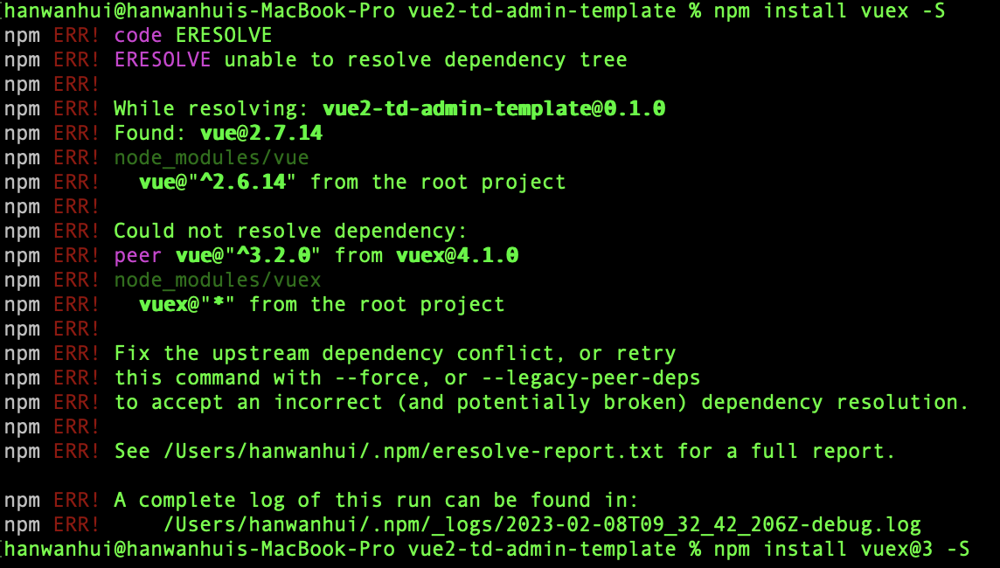

[[toc]]

## 通过vue-cli安装vue3项目遇到的版本问题


::: tip  解决方案
将vue-template-compiler依赖包更新到个当前vue版本保持一致即可，如vue的版本为2.6.14,则vue-template-compiler版本也要保持在2.6.14上面。
:::

## vue-cli 安装使用less
``` bash
npm install less less-loader --save-dev
```
新版本的vue-cli可能预配置了less,sass等，所以，直接安装完就可以了，后续有问题我在排查。

## vue-cli 安装vue2中，使用vuex, vue-router遇到的问题
如果基于vue2,使用vuex,vue-router一定不要使用最新版的vuex和vue-router，否则会报以下错误.

- 只要安装版本3的即可。
```bash
npm install vuex@3 vue-router@3 -S
```
